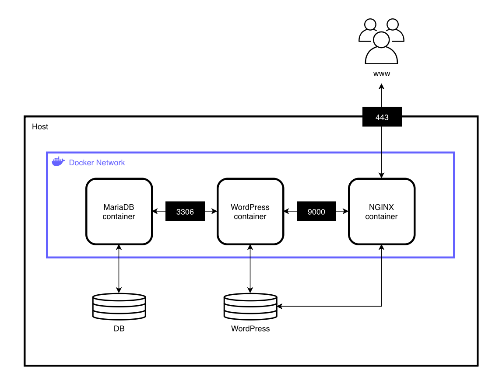

# Inception




mkdir -p ~/data/mariadb ~/data/wordpress ~/data/certs

[Docker CLI Reference](https://docs.docker.com/reference/cli/docker/)

[Git Example](https://github.com/Xperaz/inception-42)

[Eval Sheet](https://github.com/Khoubaib-Boughalmi/42-evals/blob/master/ng_3_inception.pdf)

[VM Installation](https://github.com/Bakr-1/inceptionVm-guide?tab=readme-ov-file)


> _"Is the docker daemon running?"_ -> For MacOS, run `docker context use desktop-linux`

---
<br/>


# Evaluation

When evaluation starts, run:

```bash
# Clear all docker services
docker stop $(docker ps -qa); docker rm $(docker ps -qa); docker rmi -f $(docker images -qa); docker volume rm $(docker volume Is -q); docker network rm $(docker network Is -q) 2>/dev/null

# Delete volumes
sudo rm -rf ~/data/mariadb/* ~/data/certs/* ~/data/wordpress/*
```

**Login**: [https://qbeukelm.42.fr/wp-login.php](qbeukelm.42.fr/wp-login.php)


## Project Overview

### What is Docker

Docker is a container engine that runs applications in containers on top of the host OS kernel.

- **Container**: an isolated runtime (filesystem, process, network, users) that packages an app with its dependencies. Isolation is provided by the Linux namespace and C-Groups (control groups); not virtualization. Containers can share data with **volumes** and talk to eachother on Docker managed **networks**. Show running containers with `docker ps`.

- **Image**: a immutable, layered filesystem snapshot and metadata (entrypoint, default command, environment, exposed ports). Containers are running instances of images.

- **Volume** is storage that lives outside a container's writable layer so that data persists when containers are recreated or updated.

- **Network** allows contaienrs to communicate. Containters attached to the same network can reach eachother by **IP** and **Name** (Dockers DNS). A **netowrk driver** defines how the network works. E.g **bridge** is a private subnet on the machine.


### How Docker works

Docker is based on the **Client Daemon Model**. The client runs docker commands, which talk to dockerd over a local API.

- **Client** is any program that calles the **Docker Engine API**. E.g. CLI (Command-Line Interface) `docker ...`.

- **Daemon / Dockerd** is program that runs as a background process. It builds images and runs containers.

- **Docker Compose** is a **client** that reads a YAML file and asks the daemon to build and start all services together.

> **_Is using daemons a good idea?_** <br>
> For Docker avoid daemon processes. Run services in the **foregroud** so they become **PID 1**. (`nginx -g daemon off;`, `php-fpm -F`, `mysqld`). This keeps signals, logs, heath, and lifecycle correct.


### Docker with / without Compose

- **Without Compose** run a single image/container manually (`docker run ...`), and must configure networks, env vars, and volumes by hand every time.

- **With Compose** declare the entire stack once, including inter-service networking and persistence. Compose ensures consistent, repeatable bring-ups with one command (`docker compose up`).


### Benifit of Docker compared to VM

1. **Footprint**:Containers share host kerel, and are lighter and faster to start (ms/s) vs. VMs (boot OS, minutes).

2. **Density**: Run many containers on the same host efficiently.

3. **Immitability**: images are versioned and reporiducible.

4. **Isolation**: process, filesystem, network isolation without full hardware virtualization.

5. **Virtualization**: a VM virtualizes both the operating system kernel and the application layer. A Docker container virtualizes only the application layer, and runs on top of the host OS.

Docker containers are often used for web apps, APIs, sidecars (NGINX, Redis). For app packaging conainers are the best fit. If you need different kernels or stronger isolation, VMs are a better fit.


### The importance of the directory structure

---
<br/>


# Networking and DNS

Docker compose creates private network `web`. All services are attached to this network and can comunicate to eacher **without exposing ports to the host**.

```bash
# List networks
docker network ls

# Inspect network
docker network inspect web
```

### Domain Name System (DNS)

Inside the network, each service is reachable by its **service name**. Compose injects a DNS server so `wordpress` can reach `MariaDB` at `mariaDB:3306`.

---
<br/>


# NGINX with SSL/TLS

NGINX is a high-performance, **event-driven** web server.

It can **serve static files** (HTML, CSS, images) very fast, act as a **gateway** to forward requests to backend apps, and act as a **load balancer** to spread load accross multiple backends.

- **Transport Layer Security (TLS)** is the standard protocol that secures network traffic, and turns `http://` into `https://`. TLS provides encryption and authentication. It does this via a **handshake** where the client and server validate a certificate, agree on ciphers and derive session keys, then send encripted application data.

- **Secure Socket Layer** is the predecessor to TLS.

- **Self-Signed Certificate** is a cerficate signed by its own private key. It encrypts traffic, but browsers wont trust it by default.


---
<br/>


# Wordpress with PHP-FPM and its Volume

Wordpress is a polular CMS (content management system) written in PHP. It gives an admin dashboard to publish posts/pages, install themes and plugins, and stores content in a **MySQL/MariaDB** database.

- **PHP-FPM**: (FastCGI Process Manager) is a process manager that runs a pool of worker processes behind an interface. It keeps PHP "warm", meaning theer are already PHP works running, instead of starting a new process each time.

---
<br/>


# MariaDB and its Volume

MariaDB is an open-source **relational database server**, used to store structured data in tables, and query it with SQL. In a Wordpress stack, PHP connects to MariaDB to read/write posts, users, options, etc.

---
<br/>


# Testing

You should not be able to access the website via `http://login.42.fr`

```bash
# View running containers
docker ps

# Check redirect
curl -I http://qbeukelm.42.fr

# HTTPS responds (-k for self-signed)
curl -vIk https://qbeukelm.42.fr

# Check certificate
openssl s_client -connect qbeukelm.42.fr:443 -servername qbeukelm.42.fr </dev/null 2>/dev/null | openssl x509 -noout -subject -issuer -dates

# Cnnect to 80 -> Expext failure
nc -vz qbeukelm.42.fr 80

# TSL v1.2 & v1.3
curl -vI --tlsv1.3 https://qbeukelm.42.fr\

# Check volumes
docker volume ls
docker volume inspect <name>
```


### Open MariaDB

```bash
# Open folder with docker-compose file
cd srcs

# Open a shell in the DB container
docker compose exec mariadb sh

# Inside the container, log in as root
mysql -uroot -p
```